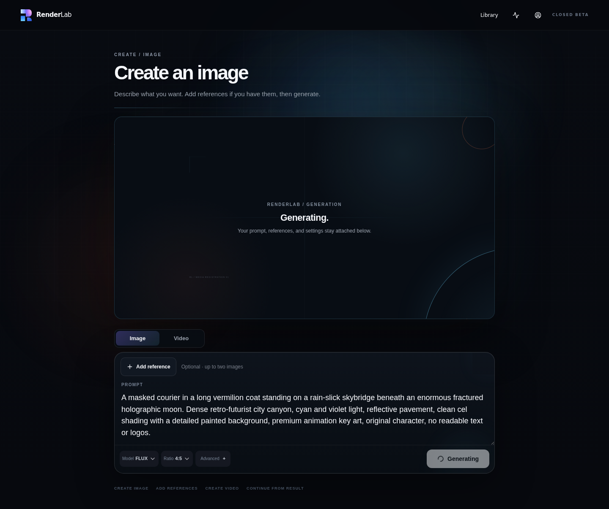
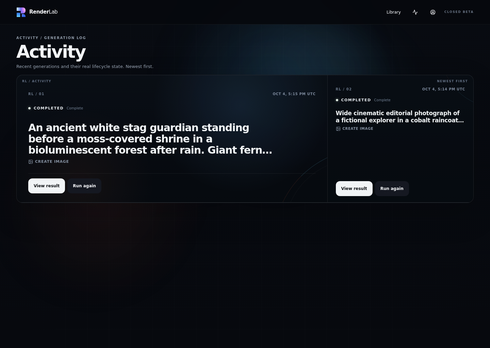
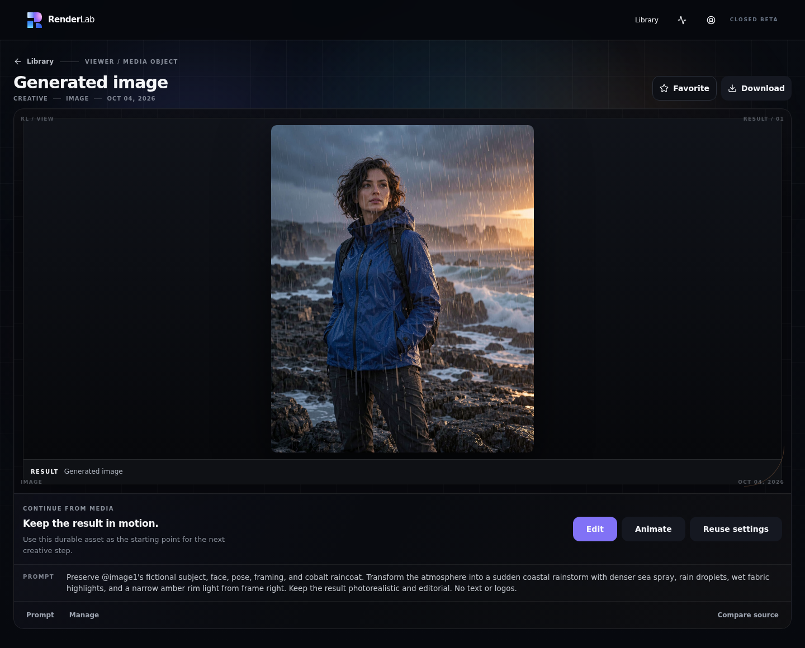
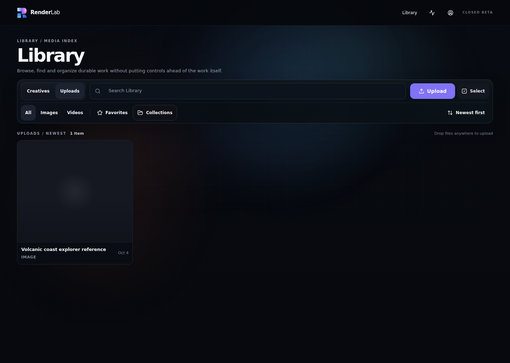
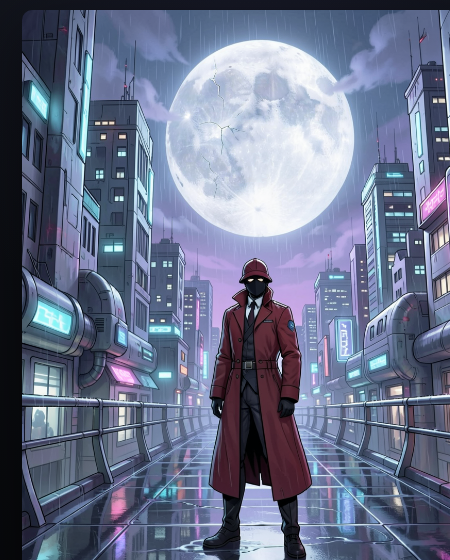
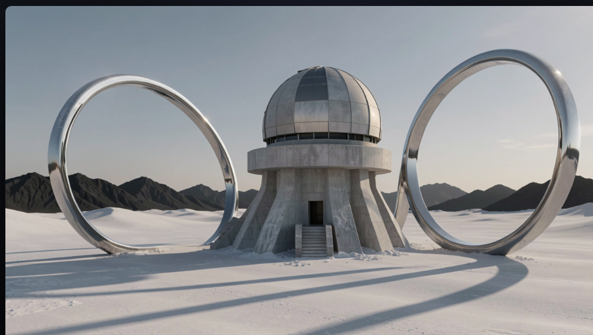
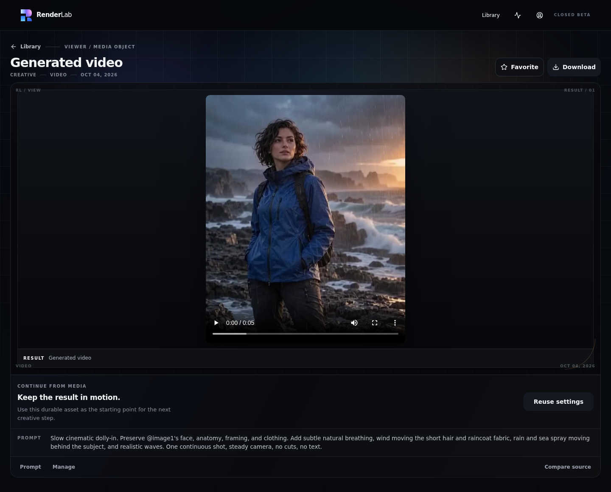
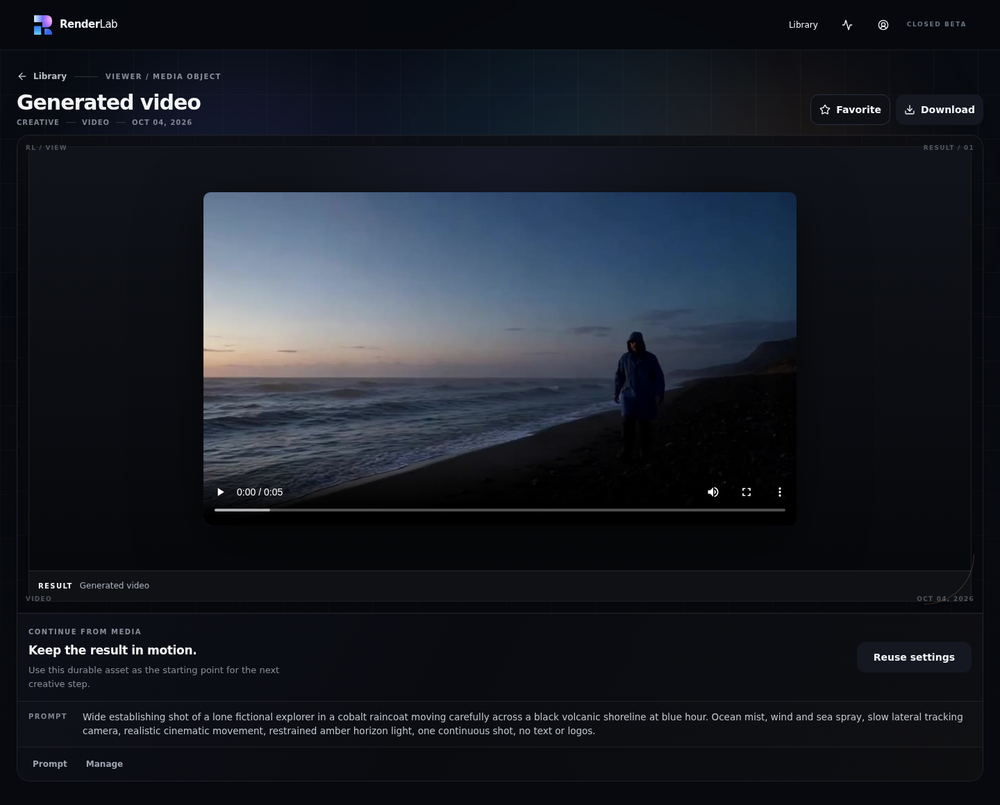
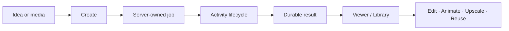
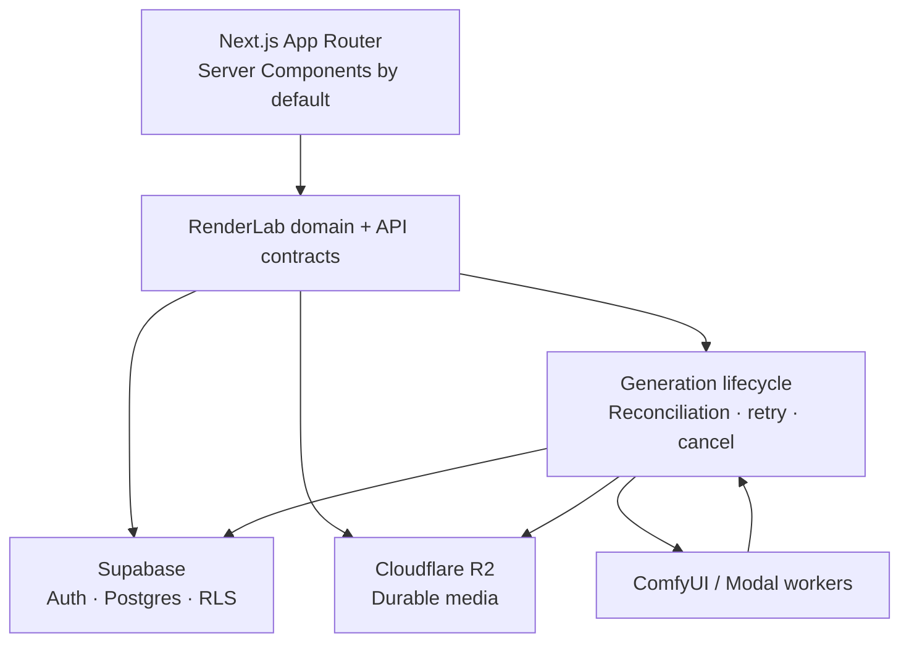

<p align="center">
  
</p>

<h1 align="center">RenderLab</h1>

<p align="center">
  <strong>A production AI media workspace that turns complex ComfyUI pipelines into durable image and video workflows.</strong>
</p>

<p align="center">
  Create, edit, animate, organize, and continue from generated media while RenderLab handles workers, job state, storage, retries, and provider complexity.
</p>

<p align="center">
  <a href="https://renderlab.faresuniform.uk"><strong>Live product</strong></a>
  · <a href="docs/STATUS.md">Status</a>
  · <a href="docs/architecture/PRODUCT_CAPABILITIES.md">Capabilities</a>
  · <a href="SECURITY.md">Security</a>
  · <a href="LICENSE">License</a>
</p>

<p align="center">
  <a href="https://github.com/faresmohamed260/renderlab/actions/workflows/engineering-quality.yml"></a>
  
  
  
</p>

> **Access:** RenderLab is a closed-beta, invitation-only product. The public landing page is available; private workspace access requires authorization.

## What RenderLab is

RenderLab is the product layer between a creator and a cloud-hosted generation stack. Users work with understandable operations—generate an image, edit with references, animate a still, create video, organize results, and continue from an existing asset—while RenderLab owns provider routing, job state, durable persistence, retries, cancellation, and authorization.

### Why RenderLab

- **Durable creative lifecycle.** Accepted work becomes a server-owned job and does not depend on the initiating browser remaining open.
- **Provider complexity stays behind product contracts.** ComfyUI graphs, worker identifiers, storage keys, and backend routing are not exposed as the user experience.
- **Media stays actionable.** A finished asset remains connected to prompt/provenance context and compatible next steps such as edit, animate, upscale, or reuse.

## Product surfaces

| Surface | Production role |
| --- | --- |
| **Create** | Image generation, reference-backed editing, animation, video generation, model choice, and contextual advanced controls. |
| **Activity** | Truthful queued/running/persisting/terminal job state with retry, rerun, cancellation, and result access. |
| **Media Viewer** | Asset inspection, provenance, prompt context, download/favorite actions, and compatible continuation paths. |
| **Library** | Durable generated media and uploads with search, favorites, collections, ordering, rename, download, deletion, and reuse. |
| **Settings** | Profile, preferences, credentials, sessions, MFA, export, and account lifecycle. |
| **Admin** | Authorized closed-beta operations with recent-authentication boundaries where required. |

## Product in action

### Create



Create keeps creative intent, references, model choice, aspect ratio, and advanced controls in one focused workspace.

<details>
<summary><strong>See Activity, Media Viewer, and Library</strong></summary>

### Activity



### Media Viewer



### Library



</details>

## Made with RenderLab

The examples below are **production-capture crops of real provider-backed RenderLab outputs**. The original QA fixture intentionally removed its generated R2 objects during cleanup, so these are not presented as retained raw model files.

### Cinematic editorial

<p align="center">
  
</p>

### Painterly fantasy

<p align="center">
  
</p>

### Stylized 3D

<p align="center">
  
</p>

<details>
<summary><strong>More production examples</strong></summary>

### Graphic sci-fi

<p align="center">
  
</p>

### Surreal architecture

<p align="center">
  
</p>

</details>

## Video workflows

The same bounded production verification created both an image-animation result and a text-to-video result. The retained evidence contains the completed video results in RenderLab's Media Viewer; the fixture cleanup removed the generated R2 media afterward, so this repository does not claim a retained raw motion file from that run.

<details>
<summary><strong>See provider-backed video result evidence</strong></summary>

### Image animation result



### Text-to-video result



</details>

## How the creative lifecycle works



Accepted work is reconciled independently of the browser. Finalization is designed to be idempotent so terminal job state and durable media do not depend on one client request surviving end to end.

## Architecture



RenderLab keeps schema ownership, storage prefixes, orchestration, authorization, and product contracts explicitly separated from underlying shared infrastructure. See [Infrastructure](docs/architecture/INFRASTRUCTURE.md) and [Frontend Architecture](docs/architecture/FRONTEND_ARCHITECTURE.md) for the deeper contracts.

## Security and reliability

| Concern | RenderLab approach |
| --- | --- |
| **Authorization** | Owner-scoped resource access backed by Supabase Auth/RLS and server-side ownership checks. |
| **Privileged account actions** | MFA/session controls and recent-authentication boundaries for sensitive operations. |
| **Media delivery** | Server-owned storage access and presigned delivery/upload boundaries. |
| **Long-running generation** | Browser-independent reconciliation with bounded retry/cancellation behavior. |
| **Finalization** | Idempotent persistence and explicit terminal-state handling. |
| **Failures** | Sanitized user-facing failures while operational detail remains server-side. |
| **Data lifecycle** | Account export/deletion and fixture cleanup workflows. |
| **Security reporting** | Private reporting guidance in [SECURITY.md](SECURITY.md). |

## Technology

- **Application:** Next.js 16, React 19, TypeScript 7, Tailwind CSS 4
- **Interface:** Radix/shadcn-derived primitives, Motion for React, Lucide
- **Data and identity:** Supabase Auth, PostgreSQL, Row Level Security
- **Media:** Cloudflare R2
- **Generation:** curated ComfyUI workflows on a partitioned Modal worker fleet
- **Quality:** Oxlint, TypeScript, Node test runner, Playwright, repository-specific contract verifiers
- **Delivery:** Vercel with guarded production qualification

## Local development

### Prerequisites

- Node.js **24.x** (see `.nvmrc`)
- npm **11.x** (`packageManager` remains pinned to npm 11.6.2)
- Git on native Windows or Linux/WSL2. macOS is expected-compatible but is not an ENT-008 verified exit platform.

Verify the active toolchain before installing dependencies:

```bash
npm run doctor
npm run verify:text-policy
npm ci --no-audit --no-fund
```

The repository's ordinary lint/type/unit/static/build path is intentionally **secret-free**. You do not need a real `.env.local`, Supabase/R2/Vercel/Resend/Modal credentials, or provider access to run it. `.env.example` documents supported runtime variable names only; create `.env.local` when a specifically authorized configured/shared-resource workflow requires it.

For local product development after the toolchain/install checks:

```bash
npm run dev
```

`.gitattributes` makes repository-owned text LF on both native Windows and Linux/WSL, independent of a developer's global `core.autocrlf` setting. If `npm run verify:text-policy` reports CRLF in an existing checkout, use a fresh checkout after the policy is present rather than mass-editing file contents.

### Secret-free quality checks

```bash
npm run doctor
npm run verify:text-policy
npm run lint
npm run typecheck
npm run test:unit
npm run verify:engineering-quality
npm run verify:modal-project-ownership
npm run verify:ui-purity
npm run build
```

The Developer Portability workflow runs that same path from fresh Linux and Windows checkouts. Feature-specific Playwright, integration, account lifecycle, generation, media, cleanup, provider-backed, and production-verification workflows under `.github/workflows` remain separate and may require protected credentials, run-owned fixtures, cleanup, and explicit authorization.

## Repository map

| Path | Owns |
| --- | --- |
| `src/app` | Routes and server/client boundaries |
| `src/features` | Product features and domain-facing UI |
| `src/components/ui` | Approved shared UI primitives |
| `src/server` | Server-owned domain, generation, storage, account, and operational logic |
| `workers` | Generation adapters and worker entry points |
| `supabase` | RenderLab-owned schema migrations |
| `scripts` | Verification, maintenance, and operational tooling |
| `tests` | Unit, integration, and browser contracts |
| `docs/architecture` | Architecture, infrastructure, security, and capability contracts |
| `docs/ui` | UI decisions, system, screens, and migration state |

## Documentation

For engineering work, start with:

1. [Product capabilities](docs/architecture/PRODUCT_CAPABILITIES.md)
2. [Frontend architecture](docs/architecture/FRONTEND_ARCHITECTURE.md)
3. [Infrastructure and security boundaries](docs/architecture/INFRASTRUCTURE.md)
4. [Current public status](docs/STATUS.md)
5. [Product/UI foundation](docs/ui/UI_MIGRATION.md)
6. [Durable UI decisions](docs/ui/UI_DECISIONS.md)
7. [Visual north star](docs/ui/VISUAL_NORTH_STAR.md)
8. [AI-agent development instructions](AGENTS.md)
9. [Detailed project handoff/history](PROJECT.md)

## Known limitations

- RenderLab is closed beta; private workspace access is not public self-service.
- There is no supported public API or community plugin contract yet.
- Provider-backed generation depends on configured worker/provider availability and admission controls.
- Some model/workflow routes remain capability-gated until production ownership and readiness are verified.
- The retained artistic QA fixture cleaned its generated R2 objects, so the current public gallery uses verified production-capture crops rather than raw downloadable model outputs.
- The project currently uses exact production commit qualification rather than a public semantic-release stream.

## Current direction

Current work is focused on deeper creative capability rather than exposing more infrastructure:

- broaden image and video workflows while preserving one coherent Create experience;
- improve continuation among generation, editing, animation, video, and upscale operations;
- deepen media organization and creative project workflows;
- continue responsive, motion, and accessibility refinement;
- expand provider/worker capability only when ownership and production readiness are verified;
- preserve lifecycle, cleanup, security, and exact-commit qualification as the product grows.

See [STATUS.md](docs/STATUS.md) for the concise current state and `PROJECT.md` for detailed implementation history.

## Contributing, security, and license

RenderLab is source-visible for portfolio/evaluation purposes and is **not currently an open-source community project**. See [CONTRIBUTING.md](CONTRIBUTING.md) before proposing changes, [SECURITY.md](SECURITY.md) for vulnerability reporting, and [LICENSE](LICENSE) for usage rights.

---

<p align="center">
  <strong>Render what you imagine. Keep the thread alive.</strong>
</p>
