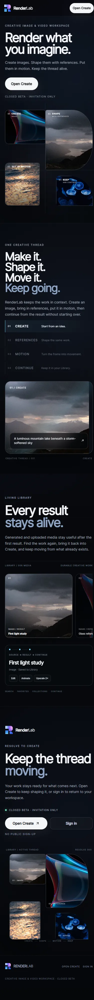
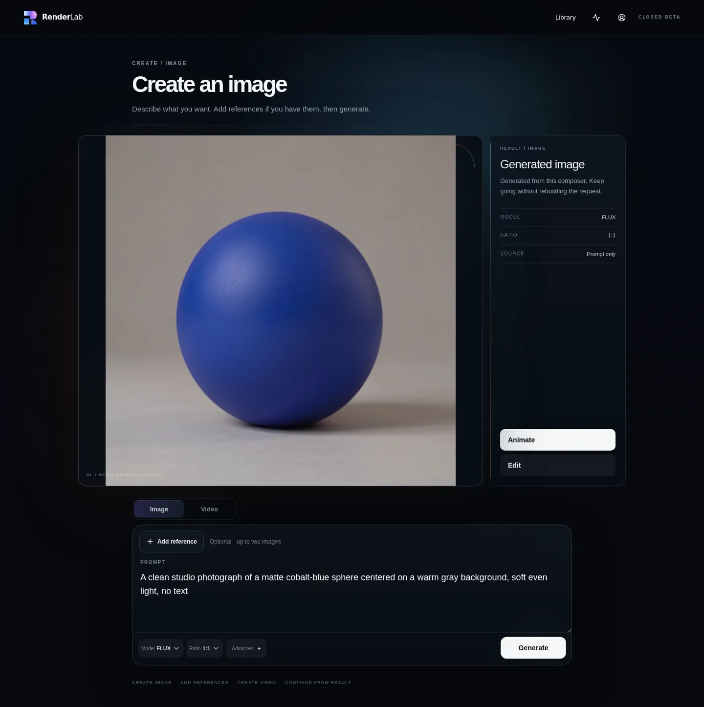
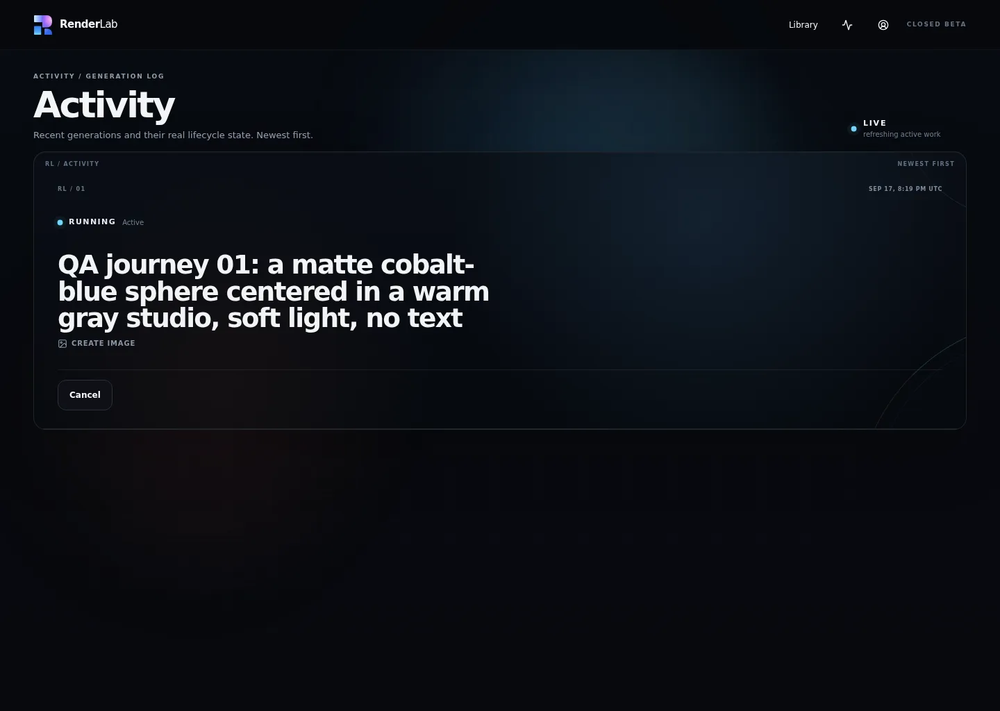
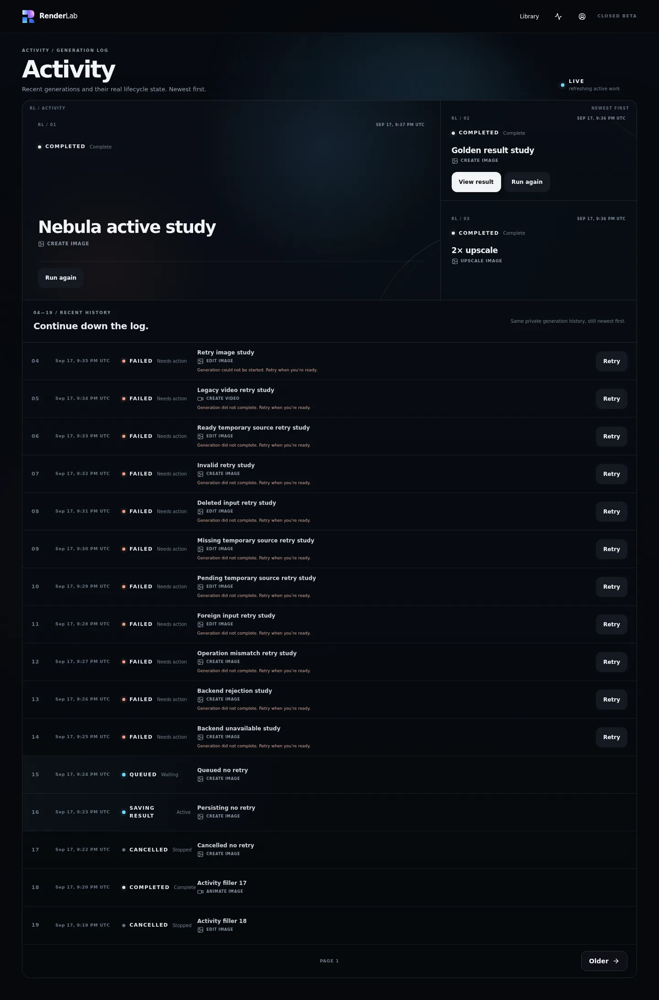
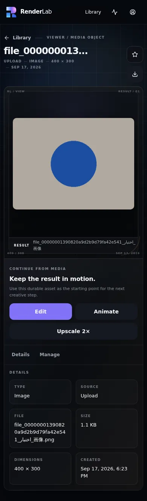
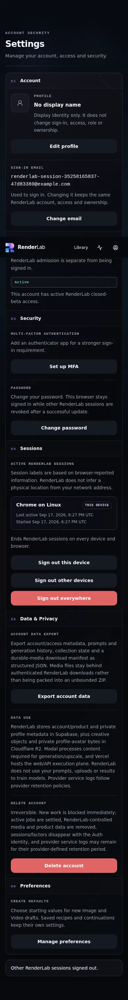

# RenderLab production user audit — 2026-09-17, production closure updated 2026-09-18

## Verdict

**Production acceptance: QA-003 COMPLETE / WHOLE-PRODUCT AUDIT STILL OPEN.** The live custom domain now serves exact source `2fc64231f8aa0e5a2df8b2698824319a25c4e9f8`. Guarded rollout `35373771751` created READY deployment `dpl_Cssdq7grVd6eGkN4Y1xqdWPqV8bz`, explicitly moved `renderlab.faresuniform.uk`, passed the accepted custom-domain smoke set and did not invoke rollback.

Final QA-003 run `35374052822` then passed the bounded fixture-only production contract: Cancel traversed `cancelling → cancelled`; Retry and Run Again reached `succeeded`; the dedicated Admin fixture enrolled TOTP, completed a fresh AAL2 challenge and exposed read-only Admin on desktop and 390px. Artifact `10559613086` (`sha256:fcba296a446a28c0867654018ec4692c2af5c2779902902a6774f3020f18e92c`) contains 32 screenshots plus the source/domain/cleanup manifest. Human review found the Activity/Admin states responsive and readable, keyboard focus visible and reduced-motion geometry functional. Exact pre/post DB/Auth fixture-absence checks passed; the manifest records verified cleanup with four R2 objects checked.

No P0–P3 defect is currently reproduced in completed production-audit coverage. **This is still not a claim that every RenderLab feature has been exhaustively exercised on production.** QA-004 is now governed by `docs/audits/QA_004_ACCOUNT_SECURITY_DATA_PRODUCTION_AUDIT_CONTRACT.md` but has not yet executed; QA-005 remains roadmap-only until QA-004 evidence exists.

## Audit identity and production provenance

| Item | Verified value |
| --- | --- |
| Custom domain | `https://renderlab.faresuniform.uk` |
| Live repository source | `2fc64231f8aa0e5a2df8b2698824319a25c4e9f8` |
| Guarded rollout | GitHub Actions run `35373771751`, `Deploy QA-003 Run Again Fix 2026-09-18`, successful |
| READY deployment | `dpl_Cssdq7grVd6eGkN4Y1xqdWPqV8bz` / `https://renderlab-hrydffycn-faresmohamed260-6733s-projects.vercel.app` |
| Rollout proof | Pristine exact-source checkout; forced CLI production deploy; explicit custom-domain alias; smoke on `/`, `/create`, `/library`, `/activity`, `/settings`, `/settings/password`, `/settings/profile`, and `/settings/preferences`; rollback skipped |
| Prior rollback anchor | `dpl_ASvYe7jgaZMBPqsh6weHLEo4mdxT` / source `ae083473e29a0f9e60f49087a33d1c8d0ce95cd1` |
| QA-003 production run | `35374052822`, successful |
| QA-003 source confirmation | Exact expected production SHA `2fc64231f8aa0e5a2df8b2698824319a25c4e9f8`; bounded fixture-only provider-work confirmation `true` |
| QA-003 artifact | `production-qa003-activity-admin-35374052822-1`, artifact `10559613086` |
| QA-003 artifact digest | `sha256:fcba296a446a28c0867654018ec4692c2af5c2779902902a6774f3020f18e92c` |
| QA-003 evidence | 32 screenshots plus manifest; desktop, 390px, visible-focus and reduced-motion states human-reviewed |
| QA-003 cleanup | Exact pre/post DB/Auth absence passed; manifest `verified=true`, four R2 objects checked |
| Runtime inspection | No grouped runtime errors in the bounded rollout/audit window; per-entry runtime logs unavailable because Vercel returned `ExceedsBillingLimitError` |

Historical audit/fix provenance below remains relevant for the earlier #279 completion-refresh defect and the initial whole-product baseline.

## Method and safety boundary

Testing now combines four perspectives:

1. A signed-out, headed-browser walkthrough of the real custom domain at desktop and 390×844 mobile-class geometry.
2. The original isolated authenticated production fixture run against the real custom domain, with exact run-scoped cleanup. This exercised real persistence and the baseline creative journeys while avoiding real-user records.
3. The original real administrator-account read-only walkthrough after the owner signed in manually. This verified actual account admission, history, Library, Settings, session inventory and the privileged Admin gate without changing the account.
4. Final QA-003 run `35374052822`, using dedicated run-owned Activity and Admin fixtures. That run exercised the explicitly bounded provider-backed Cancel/Retry/Run Again contract, enrolled TOTP on the run-owned Admin fixture, completed a fresh AAL2 challenge, audited Admin read-only on desktop/390px, and exactly cleaned the fixture state.

The real owner account was never used for password/email changes, MFA enrollment/removal, export/deletion, session revocation, media mutation, Activity action mutation or Admin-global mutation. QA-003 performed only its separately authorized fixture-owned mutations. Global generation settings, real invitations and real-user history remained untouched.

## Severity scale

| Severity | Meaning |
| --- | --- |
| P0 | Production unavailable, broad data loss, or critical security compromise |
| P1 | Core journey blocked or severe integrity/security failure |
| P2 | Major feature degradation with a workaround |
| P3 | Localized functional, accessibility or responsive defect |
| P4 | Documentation, polish, or test-depth issue without current user harm |

## Findings

### RLQA-001 — Current production pointer was stale in repository documentation

- **Severity:** P4
- **Status:** corrected by this audit documentation change
- **Scope:** release governance / repository handoff; no runtime impact
- **Reproduction:** inspect the current-production sections in `PROJECT.md`, `docs/ui/UI_MIGRATION.md`, `docs/ui/SCREEN_REGISTRY.md`, and `docs/architecture/INFRASTRUCTURE.md` after rollout `35253785761`.
- **Expected:** the authoritative repository identifies live source `c2b7c022cd91167822f75874ef7caf70b0ec264c` and the 2026-09-17 rollout.
- **Actual before this audit:** the documents still identified 2026-09-15 source `d18ef8833d46c812dac6b43572b3f4f7069990f8`; Screen Registry also described Profile/Preferences as not deployed although both were live.
- **Evidence:** rollout `35253785761`; direct production HTTP 200; authenticated live routes `/settings/profile` and `/settings/preferences`; this report's coverage and screenshots.
- **Suspected owner/component:** release governance and post-deployment documentation closure.
- **Remediation:** completed in this branch by updating the four authoritative current-state records. Future guarded rollouts should include a required post-cutover documentation-sync PR or checklist item.

### RLQA-002 — Activity does not refresh a completed generation to its terminal result

- **Severity:** P2
- **Status:** **RESOLVED IN PRODUCTION** by PR #277 / merged main `ae083473e29a0f9e60f49087a33d1c8d0ce95cd1`; guarded rollout `35292170973`; live re-verification `35292334383` passed all four generation journeys; issue #279 may close.
- **Scope:** Create/Activity lifecycle, durable-result discovery, and every continuation that depends on reaching Viewer; shared logic affects desktop and mobile
- **Reproduction:** sign in with an admitted account; submit a valid Image generation from `/create`; after acceptance open `/activity`; leave the page on the row displaying `RUNNING` and `refreshing active work`.
- **Expected:** Activity reconciles the job to `Complete`, removes Cancel, exposes View result/Run again when eligible, and lets the user reach the durable Viewer.
- **Actual:** corrective run `35269965598` accepted job `27de0eb4-288b-4eb1-9e51-5911a9bed20a` at 20:19:28 UTC; Activity remained `RUNNING` until the 30-minute bound expired. No View result appeared. The product owner independently confirmed the media completes but the site fails to refresh.
- **Evidence:** [Create accepted/generating](evidence/create-desktop-active-stuck-journey.webp); [Activity stuck running](evidence/activity-desktop-stuck-running.webp); run `35269965598`; artifact `10518743048` / `sha256:608daf18ffc6dd8918736f20f6cf17a68de0545aa425adaac88132f2c07d8561`.
- **Root cause:** `src/features/activity/activity-auto-refresh.tsx` used one `setTimeout`. The first server refresh retained the mounted component with `enabled=true`, so the effect dependencies did not change and no later timer was scheduled. Jobs completing after that single refresh remained visually stale until manual navigation.
- **Implemented fix:** use one cleaned-up five-second interval while active server truth enables observation. The configured regression waits through the first refresh, terminalizes its fixture afterward, and requires the same mounted page to render `Completed` on a later refresh. Activity Visual run `35277589256` passed, including exact fixture cleanup. [Configured fixed state](evidence/activity-auto-refresh-fixed-desktop.webp).
- **Production proof:** run `35292334383` observed real Image, Edit, Animate and standalone Video jobs advance to `succeeded` on the same mounted Activity page, exposed `View result`, opened durable Viewer media, and verified both desktop and 390px Viewer geometry. The artifact contains 26 screenshots; cleanup and independent zero-residue verification passed.
- **Residual hardening:** provider/reconciliation failure surfacing remains a separate QA concern; no such failure was reproduced in the successful post-fix run.

## Coverage matrix

| Area | Desktop | 390px / narrow | Result and evidence |
| --- | --- | --- | --- |
| Landing and navigation | Signed-out live walkthrough | Live 390×844 and reduced-motion fixture coverage | Pass. Correct public/application shell boundary, Closed Beta truth, working navigation and no horizontal overflow. [Mobile landing](evidence/signed-out-mobile-landing.webp) |
| Signed-out access | Settings sign-in, Create gating, Library/Activity states | 390px Settings and Create | Pass. No public sign-up claim, private actions gate truthfully, keyboard focus is visible. [Mobile keyboard focus](evidence/signed-out-mobile-settings-focus.webp) |
| Create — Image | Real production Image through Create → Activity → Viewer | Viewer rechecked at 390px | **Pass after fix.** Run `35292334383` reached `succeeded`, exposed View result and loaded durable image Viewer on both viewports. Artifact `10527172224`: `01-create-image-desktop-*`. |
| Create — Video | Real standalone Video submitted at 390px | Activity + Viewer at 390px | **Pass after fix.** Run `35292334383` traversed Running → Persisting → Completed and loaded a 5-second durable video with native controls on desktop and mobile. Artifact `10527172224`: `04-create-video-mobile-*`. |
| Create references | Real durable upload/drop, aliases, reorder and limits | Narrow source layout | Pass. Two Image references and one Video start-image boundary enforced; aliases remained stable through reorder; cleanup exact. |
| Library browse/search/filter | Real run-owned upload, Creatives/Uploads, type and selection behavior | Narrow list/grid and controls | Pass. Search/filter/sort/selection remained coherent. [Desktop upload](evidence/library-desktop-upload.webp) |
| Viewer and actions | Real Image, Edit, Animate and standalone Video results opened from Activity | All four results rechecked at 390px | **Pass for generated-result viewing/continuation path.** Image and video pixels loaded durably; videos exposed native controls; no horizontal overflow. Destructive/manage mutations remain controlled-fixture scope. Artifact `10527172224`. |
| Activity/history | Real Image/Edit/Animate/Video lifecycle plus run-owned Cancel/Retry/Run Again | Same responsive Activity surface | **Pass.** Baseline creative journeys terminalized correctly, and QA-003 run `35374052822` proved Cancel `cancelling → cancelled`, Retry `running → succeeded`, and Run Again `running → succeeded` with desktop/390px evidence. |
| Profile | Real empty-profile read-only state; controlled save/crop/keyboard fixture | 390px reduced-motion crop | Pass. Identity copy and ownership separation are clear. [Mobile profile](evidence/settings-profile-mobile-reduced.webp) |
| Password and email | Real forms inspected; controlled password-field behavior | Narrow fixture coverage | Pass for layout, labels, disabled-until-valid behavior, reveal controls and 15-character policy copy. Real credentials/email were not changed. |
| Sessions | Real privacy-safe inventory inspected; controlled local/other/global sign-out semantics | 390px session register | Pass. Real sessions were not revoked. [Mobile sessions](evidence/settings-sessions-mobile.webp) |
| MFA / step-up | Real fail-closed boundary plus dedicated run-owned TOTP enrollment and fresh AAL2 challenge | Desktop and 390px challenge/enrolled states | **Pass for QA-003 scope.** The dedicated Admin fixture enrolled TOTP, completed a fresh AAL2 challenge and reached the privileged surface without bypassing the gate. |
| Data & Privacy | Real export/delete copy and disclosure inspected | Existing account-lifecycle fixture coverage | **Partial.** Presentation and prior controlled lifecycle tests were inspected; this audit did not submit a fresh production export/delete fixture journey. |
| Preferences | Real default state inspected; controlled save, cross-device read, stale fallback, reset, precedence and export/deletion integration | 390px reduced-motion | Pass. [Mobile preferences](evidence/settings-preferences-mobile-reduced.webp) |
| Admin | AAL2-authenticated run-owned Admin fixture; health/access/generation presentation read-only | 390px plus reduced-motion read-only evidence | **Pass for QA-003 scope.** Admin content was reached after fresh AAL2 and visually audited without global mutation; evidence remained fixture-safe. |
| Keyboard/focus | Tab/focus on signed-out and authenticated controls | Narrow visible focus | Pass. Focus indicator remained visible and control labels were announced. |
| Reduced motion | Repository-controlled production fixture run | Landing/Create/Viewer/Settings at 390px | Pass. Functional content and geometry remained present without motion dependency. |
| Empty/loading/error | Signed-out empties, MFA loading→ready, failed Activity row, generation start/result | Narrow equivalents | Pass. States were truthful and recoverable; no indefinite loading observed. |
| Production runtime | Guarded exact-source rollout plus real browser journeys | Same origin | **Pass for exercised scope.** The current deployment has no grouped runtime errors in the bounded rollout/audit window. Per-entry runtime logs are billing-limited, so warning/info-log absence is not claimed; whole-product coverage is still incomplete. |

## Representative evidence

### Signed-out mobile landing

### Authenticated Create result

### Reproduced lifecycle-refresh defect

### Configured fix verification

### Mobile Library viewer

### Mobile account sessions

The committed images contain only public UI or run-owned test-fixture data. Real-account email, private prompts, media and session timestamps are deliberately excluded.

## Cleanup and data-integrity result

The successful controlled audit used run-owned Auth/account/access, jobs, sources, uploaded media, preference/profile/session and R2 objects. Every mutating script completed its own exact cleanup; the workflow's unconditional cleanup leg also passed. The one real generated image and the Library upload were removed with their owned rows/objects. No test residue was reported.

An earlier audit attempt, run `35257837265`, stopped before product actions because the cleanup-only Activity harness lacked `RENDERLAB_GENERATION_BACKEND_URL`. Its unconditional cleanup ran. The corrected run `35258165837` supplied the required test-only value and passed. This was an audit-harness configuration failure, not a production product failure.

Corrective end-to-end run `35269965598` was the product finding that led to #279. It submitted through the live Create UI, captured the active Create state, opened live Activity, and waited 30 minutes for the row to advance. It did not. Its unconditional cleanup removed the run-owned account/job/media state and evidence upload passed.

Final QA-003 run `35374052822` used separate run-owned Activity and Admin fixtures. Pre-cleanup verified exact DB/Auth absence, the audit completed Cancel/Retry/Run Again plus fresh-AAL2 Admin coverage, post-cleanup again verified exact DB/Auth absence, and the manifest records verified cleanup with four R2 objects checked.

## Prioritized remediation roadmap

### QA-000 / issue #279 — Repair and prove generation completion refresh (P2)

**Outcome:** Activity and Create advance accepted jobs to truthful terminal state without manual recovery, and successful jobs reliably expose durable Viewer results.

**Status:** **COMPLETE / PRODUCTION-LIVE / LIVE USER PATH VERIFIED.** PR #277 merged as `ae083473e29a0f9e60f49087a33d1c8d0ce95cd1`; rollout `35292170973` succeeded; production journey `35292334383` passed all four generation paths with exact cleanup.

**Acceptance achieved:** live Image, Edit, Animate and standalone Video all reached durable Viewer results through Activity on the fixed production source; desktop/390px evidence and exact cleanup passed. Provider/reconciliation failure surfacing is carried forward as a separate QA hardening item rather than keeping the resolved timer defect open.

### QA-001 — Close production release-record drift at rollout time (P4)

**Status:** **COMPLETE / VERIFIED.** Contract PR #294 and implementation PR #295 are merged; exact implementation-head Engineering Quality `35402854810` and merged-main Engineering Quality `35402927526` passed. Reusable Production Documentation Sync proof run `35413607297` supplied exact deployed source `2fc64231f8aa0e5a2df8b2698824319a25c4e9f8` and passed the four-authority marker/prose check. The temporary branch-only caller was reset to `main` after proof. Future release closure now fails closed on stale current-production documentation.

**Outcome:** every explicit production rollout leaves `PROJECT.md`, UI Migration, Screen Registry and Infrastructure pointing at the exact live source and rollout evidence.

**Acceptance:** a post-cutover check fails or opens a required documentation task when the four current-production pointers disagree with the deployed SHA. Historical phase-local status is preserved, but the current-production block always wins.

### QA-002 — Add a permanent non-destructive production user-journey workflow (P4)

**Status:** **IMPLEMENTATION MERGED + MERGED-MAIN VERIFIED / PRODUCTION RUN NOT YET PERFORMED.** Authority is `docs/audits/QA_002_PERMANENT_PRODUCTION_USER_JOURNEY_CONTRACT.md`. PR #298 merged the hardened existing workflow as `db48d14fa5265036066531cba8aa93d9ac6602f5`; exact-head Engineering Quality `35414005279` and merged-main `35414043345` passed. The workflow now requires exact production-SHA/provider acknowledgement, covers read-only Settings/Profile/Preferences/Sessions, emits a source/domain manifest and independently verifies DB/Auth/R2 cleanup. QA-002 remains open until the manual production run and human evidence review pass.

**Outcome:** the useful parts of audit run `35258165837` become a reviewed, manually dispatched workflow rather than temporarily replacing an existing workflow file.

**Acceptance:** isolated fixture identity; exact cleanup; desktop plus 390px evidence; public routes, Create, Library, Viewer, Settings/Profile/Preferences/Sessions; no real-user data; no account deletion; no Admin-global mutation; artifact manifest with source SHA and domain.

### QA-003 — Add fixture-safe Activity action and AAL2 Admin visual coverage (P4)

**Outcome:** Retry/Run Again/Cancel eligibility and the complete Admin surface can be audited on production without touching real history or global settings.

**Status:** **COMPLETE / PRODUCTION-VERIFIED.** Final run `35374052822` passed on production source `2fc64231f8aa0e5a2df8b2698824319a25c4e9f8` with the contract's explicit bounded fixture-only provider work. Cancel, Retry and Run Again reached truthful terminal states; the dedicated TOTP fixture reached fresh AAL2 and read-only Admin; 32 screenshots were human-reviewed; exact cleanup passed.

### QA-004 — Complete isolated account/security/data production acceptance (P4)

**Outcome:** exercise the production forms and state transitions that were intentionally not submitted on the real owner account: profile save/remove, preferences save/reset, session semantics, password/recovery presentation, MFA enrollment/challenge boundary, data export, and account deletion.

**Status:** **EXECUTION CONTRACT + PERMANENT HARNESS MERGED / PRODUCTION RUN NOT YET PERFORMED.** Authority is `docs/audits/QA_004_ACCOUNT_SECURITY_DATA_PRODUCTION_AUDIT_CONTRACT.md`. PR #292 / `4254f07ab044d2d1d815498844513bf57e451ba6` merged the manual-only workflow and production orchestrator after the workflow YAML serialization defect was corrected; exact PR head and merged-main Engineering Quality passed. The contract requires run-owned accounts only, no provider-backed generation, desktop/390px secret-safe evidence, a sentinel non-interference account and exact Auth/database/R2 cleanup. Secure email-change acceptance is conditional on an explicitly available dedicated mailbox pair and bounded hosted rate-limit budget.

### QA-005 — Bound generation reconciliation/error presentation (P4)

**Outcome:** prove that provider/reconciliation failures do not leave Activity claiming indefinite refresh.

**Acceptance:** controlled non-provider failure seams or run-owned failure fixtures exercise server reconciliation error handling and produce a bounded actionable state without exposing provider internals.

These items are the next QA roadmap and are tracked by GitHub issue #278. They do not authorize unrelated product implementation, production deployment, hosted Auth changes, or global Admin configuration changes.

## Final judgement

The original P2 generation-completion defect remains fixed and live-user verified, and QA-003 now closes the fixture-safe Activity mutation plus AAL2 Admin gap on exact production source `2fc64231f8aa0e5a2df8b2698824319a25c4e9f8`. Responsive evidence and cleanup are clean, and no grouped runtime-error cluster is present for the bounded current rollout/audit window.

The production audit remains **in progress** rather than exhaustive. No P0–P3 defect is reproduced in completed coverage. QA-001 and QA-003 are complete. QA-002 is execution-contracted but not yet implemented; QA-004 is execution-contracted but not yet run; QA-005 remains under issue #278 and must wait for QA-004 evidence.

